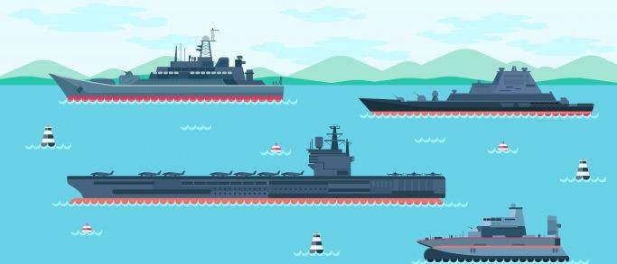
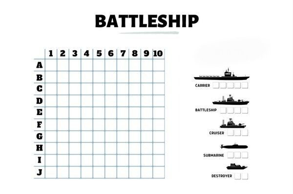

# Battleship Game Solver Project

## Overview

This project focuses on developing software capable of solving and winning game of Battleship. While the game is a favorite pastime for many people, requiring significant mental effort, it has also intrigued AI researchers. The techniques and algorithms used to solve and win at Battleship have applications far beyond mere entertainment. They can be applied to various real-world problems such as logistics, project planning, conveyor belt design, and code-breaking.

## Objectives

The primary objectives of this project are:
1. **Learning:** To understand the basic principles of software design for solving games.
2. **Application:** To apply the acquired knowledge to design and implement software for solving and winning Battleship.
3. **Competitiveness:** To develop AI algorithms that can effectively solve the game and consistently win against a human player.

## Project Scope

### Game: Battleship

#### Game Description
Battleship is a two-player strategy game where each player tries to sink the opponent's fleet of ships. The game is played on two grids per player: one grid for the player's ships and one grid for recording shots on the opponent's ships.

#### Game Setup

1. **Grids:**
   - Each player has two 10x10 grids: one for their own ships and one for tracking their shots on the opponent's grid.
   - The rows are labeled with numbers (A to J) and the columns with letters (1 to 10).

2. **Ships:**
   Each player has a fleet of ships in varying lengths:
   - 1 Aircraft Carrier (5 squares)
   - 1 Battleship (4 squares)
   - 1 Submarine (3 squares)
   - 1 Cruiser (3 squares)
   - 1 Destroyer (2 squares)

3. **Placing Ships:**
   - Ships can be placed horizontally or vertically but not diagonally.
   - Ships cannot overlap or be placed off the grid.
   - Players place their ships secretly on their own grid before the game begins.

#### Gameplay

1. **Taking Turns:**
   - Players take turns calling out coordinates (e.g., "A5") to target a location on the opponent's grid.
   - The opponent announces whether the shot is a "hit" or a "miss."
   - If it is a hit, the opponent must specify which ship has been hit. If all the squares of a ship are hit, the ship is sunk, and the opponent must declare "You sunk my [ship type]."

2. **Winning the Game:**
   - The game continues until one player has sunk all of the opponent's ships.
   - The first player to sink all of the opponent's ships wins the game.

## Project Importance

The development of software for solving and winning at Battleship has several significant benefits:
- **AI Research:** Advancing the field of AI through the development of algorithms capable of handling complex problem-solving scenarios.
- **Real-World Applications:** The techniques developed can be applied to various important areas such as logistics, project planning, and factory design.
